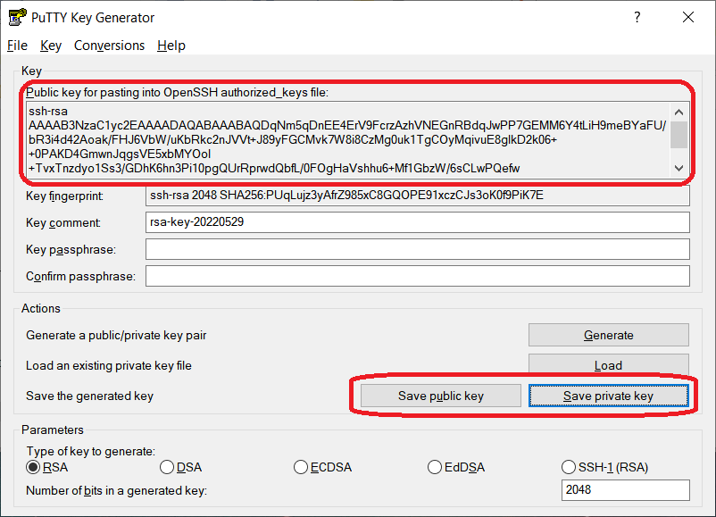

# Server-Access

How to create SSH key pair and how to access CS servers.

---

## Table of Contents  

1. [Create SSH Private/Public Key Pair](#create-ssh-privatepublic-key-pair)  
2. [Setup Keyless SSH on `bolt.cs.ucr.edu`](#setup-keyless-ssh-on-boltcsucredu)
3. [Connect to Server](#connect-to-server)
4. [Using the Server](#using-the-server)
5. [Python](#python)
6. [Remote Development](#remote-development)
7. [FAQ](#faq)

---

## Create SSH Private/Public Key Pair

- Linux and macOS

    Run the following command

    ```bash
    ssh-keygen -t rsa
    ```

    If you do not want to use a passphrase every time you SSH to a server, just press `Enter` 3 times.

    This creates a key pair under `~/.ssh` directory (`~` refers to your home directory). The private key name is `id_rsa` (no extension), the public key name is `id_rsa.pub`.

    You can also run this command on `bolt.cs.ucr.edu`.

    For more detail about SSH key pair, see [How to use ssh-keygen to generate a new SSH key](https://www.ssh.com/ssh/keygen/)

- Windows

  1. Download and install [PuTTY](https://www.chiark.greenend.org.uk/~sgtatham/putty/latest.html)
  2. Open **PuTTYGen** (PuTTY Key Generator), click **Generate**, keep all options default
     <p align="center"></p>
  3. By moving your mouse to generate some randomness, a key pair will be generated
     <p align="center"></p>
  4. **Save private key** to a **.ppk** file.
  5. When asked this, just **Yes**
     <p align="center"></p>
  6. You may **Save public key**, or just copy the public key in the large text area
  7. If you want to transfer the private key to use on Linux or macOS, select **Conversions**, then select **Export OpenSSH key**
     <p align="center"></p>

  If you generate the private key on Linux or macOS, and you want to use it on Windows, you can select **Conversions**, then select **Import key** to import your OpenSSH format private key, then **Save private key** to a **.ppk** file.

You should send your public key (either the .pub file or copy its content) to us so we can create your account on our servers.

---

## Setup Keyless SSH on `bolt.cs.ucr.edu`

Assume your username (UCR NetID) is `abc012`

- Linux and macOS

    Run the following command

    ```bash
    ssh-copy-id -i ~/.ssh/id_rsa.pub abc012@bolt.cs.ucr.edu
    ```

    Replace `~/.ssh/id_rsa.pub` with the path to your public key you just generated

    You will need to use you password to login for the first time

- Windows

    1. You can use [WinSCP](https://winscp.net/eng/index.php) to SSH to `bolt.cs.ucr.edu`, you will need to use your password to login for the first time
    2. Create a directory `.ssh` under your home directory, change its permission to **octal** `0700`
    3. Enter `.ssh` directory, create a file named `authorized_keys` with permission **octal** `0700`
    4. Edit the `authorized_keys` file, paste your generated public key as a new line into this file, and save

---

## Connect to Server

Assume you want to SSH to `dblab-rack00.cs.ucr.edu`, and your username (UCR NetID) is `abc012`

- Linux and macOS

  1. Run the following command to create `~/.ssh/config` if it does not exist

      ```bash
      if [[ ! -d ~/.ssh ]]; then
        mkdir ~/.ssh;
        chmod 0700 ~/.ssh
      fi
      touch ~/.ssh/config
      chmod 0600 ~/.ssh/config
      ```

  2. Edit the file `~/.ssh/config` (you may use `vi` command or any GUI tool), paste the following block

      ```text
      Host dblab-rack00
        Hostname dblab-rack00.cs.ucr.edu
        User abc012
        ForwardAgent yes
        ProxyCommand ssh -W %h:%p abc012@bolt.cs.ucr.edu
        IdentityFile ~/.ssh/id_rsa
      ```

      `Host`: Alias name, you can change it to whatever you want
      `IdentityFile`: Path to your private key file

  3. SSH to the server via the following command

      ```bash
      ssh dblab-rack00
      ```

- Windows

  1. Open [WinSCP](https://winscp.net/eng/index.php), select **New Site**
     <p align="center"></p>
  2. Fill **Host name** with `dblab-rack00.cs.ucr.edu`, fill **User name** with `abc012`, leave **Password** empty, then click **Advanced...**
     <p align="center"></p>
  3. In **Advanced Site Settings**, select **Tunnel** under **Connection**, check **Connect through SSH tunnel**, fill **Host name** with `bolt.cs.ucr.edu`, fill **User name** with `abc012`, leave **Password** empty, select your private key file (**.ppk**) for **Private key file**
     <p align="center"></p>
  4. Still in **Advanced Site Settings**, select **Authentication** under **SSH**, check **Allow agent forwarding**, select your private key file (**.ppk**) for **Private key file**, then click **OK**
     <p align="center"></p>
  5. Now you are back to the **Login** dialog. Click **Save** to save your site configuration
  6. You can give whatever name you prefer in the dialog
     <p align="center"></p>
  7. Now in WinSCP, you can select the site you just created, and **Login**
  8. WinSCP is for file transfer, to open an interactive terminal, click this icon or use shortcut `Ctrl + P` to open PuTTY
     <p align="center"></p>

  You may also use [OpenSSH on Windows](https://docs.microsoft.com/en-us/windows-server/administration/openssh/openssh_install_firstuse), the configuration will be similar to Linux.

  Another WinSCP alternative is [Visual Studio Code](https://code.visualstudio.com/docs/remote/ssh), the configuration should be similar to OpenSSH above.

---

## Using the Server

- Linux and macOS

    You can directly run any command in the terminal.

    To transfer files, use [scp](https://linuxize.com/post/how-to-use-scp-command-to-securely-transfer-files/) command.

- Windows
  
  WinSCP is for file transfer, PuTTY is to run commands.

---

## Python

In the terminal, type `python`, then press tab, it should show all available python to use, like

```text
python2           python3           python3.8         python3.9
python2.7         python3.10        python3.8-config  python3-config
```

You can choose the version you prefer to use. Newer servers (Ubuntu 20.04) should have python3.8 as the system default, but you can use 3.9 or 3.10 depending on your project.

If you need to install some Python packages, do so in your [virtual environment](https://docs.python.org/3/tutorial/venv.html), unless you need to install some system packages (see [FAQ](#faq)).

---

## Remote Development

You can use [PyCharm](https://www.jetbrains.com/help/pycharm/remote-development-starting-page.html) or [Visual Code Studio](https://code.visualstudio.com/docs/remote/ssh) for remote development. They can also be used as file tranfer and terminal tool.

## FAQ

1. Can I use Java?

   Yes. The servers do not have Java installed, you can download x64 Compressed Archive for Linux from [Oracle](https://www.oracle.com/java/technologies/downloads/), and setup it in your own user environment.

2. I want to install some system package.

    Please contact us the for the specific requirement.
